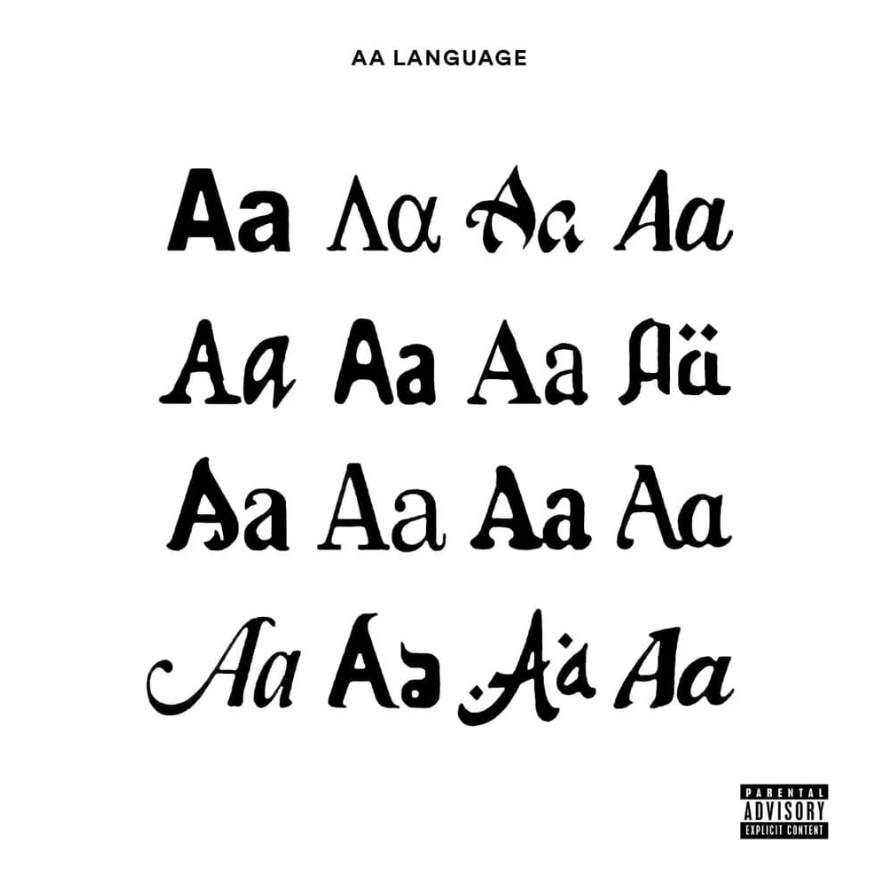

Эта директория посвящена последнему проекту первого семестра по программированию на ФизТехе - "Создание собственного языка программирования".

<p align="center">

</p>

`AA Language` (code name Gars) - мой небольшой язык программирования. 

### Структура проекта
Для разработки собственного языка нам понадобится компилятор и исполнитель. Компилятор будет переводить код из моего языка в код для исполнителя. 
Исполнитель уже есть - [SoftCpu](https://github.com/ArsenySamoylov/CoreIArs) из прошлого проекта.

Компилятор разделим на три части: `FrontEnd`, `BackEnd`, `MiddleEnd`.
`FrontEnd` - переводит код, написанный на моем языке в AST (abstract syntax tree) дерево.
`MiddleEnd` - выполняет оптимизации Ast дерева (например свертку констант).
`BackEnd` - переводит Ast дерево в ассемблерный файл для SoftCpu.

### Стандарт
Так в современном мире существует множество языков, то будет сущим кошмаром, если каждый из них будет использовать свой стандарт представления программы (в нашем случае программы представляет Ast дерево). Поэтому в нашей учебной группе мы разработали общий [Стандарт](https://github.com/dodokek/LanguageStandart) хранения Ast дерева.

### AA Language
Мой язык является просты аналогом Си. Главным отличие моего языка - это педантичность. Например каждая функция должна иметь прототип (для этого нужно добавить ключевое слово `extern`), все переменные должны инициализироваться при объявлении и так далее.

На данный момент поддерживается только один тип переменных - `double` и два типа возвращаемых функций значений - `double` & `void`.

### Примеры кода
Рассмотри несколько простых программ на моем языке.

Первым рассмотри ~~HelloWorld~~ факториал:

```
extern double fucktorial (var number);
    
double main(var argc, var argv)
    {
    var test = fucktorial(6);

    return 0;
    }


double fucktorial (var number)
    {
    if (number > 1)
        {
        var temp = number;
    
            fout << (number > 0) + (number < 0);
            
        return temp * fucktorial(number - 1);
        }

    return 1;
    } 
```

Каждая программа обязана иметь `main`, который может быть объявлен в люом месте программы.

Так же мой язык представляет встроенный функции:
`fin` - (от float input) ввод числа из stdin,
`fout` - (от float output) вывод переменной в stdout,
`pow` - возведение в степень,
`sin` - sin (очевидно =)),
`cos` - cos

Теперь рассмотри более сложный прием - все любимое квадратное уравнение:

```
extern double SquareEquationSolver (var a, var b, var c);
extern double LinearEquationSolver (var a, var c);

double main()
	{
	var a = 0;
	var b = 0;
	var c = 0;
	
	fin >> a;
	fin >> b;
	fin >> c;

	var status = SquareEquationSolver (a, b, c);
	
	return status;
	}

double LinearEquationSolver (var a, var c)
	{
	if (a > 0 + a < 0)
		{
		fout << (-1 * c) / a;
		
		return 1;
		}
	else
	if (c > 0 + c < 0)
		{
		fout << 0;
		
		return 1;
		}
	else
		{
		fout << 8;
		return 3;
		}
			
		
	return -1;
	}
	
double SquareEquationSolver (var a, var b, var c)
	{
	if (a > 0 + a < 0)
		var dummy;
	else
		return LinearEquationSolver(b, c);
	
	var dis = pow(b, 2) - 4 * a *c;
	
	if (dis < 0)
		{
		fout << -666;
		
		return -1;
		}
		
	if (dis > 0 + dis < 0)
		{
		var sqrtdis = pow(dis, 0.5);

		#fout << dis;
		#fout << sqrtdis;
		#fout << -1111;
		fout << (-1 * b + sqrtdis) / (2*a);
		fout << (-1 * b - sqrtdis) / (2*a);
		
		return 2;
		}
	else
		{
		fout << (-1 * b) / (2*a); 
		
		return 1;
		}
		
	return -1;
	}
```

На этом закончим описание языка. За более подробным описание компонентов компилятора смотрите README в соответствующих директория.